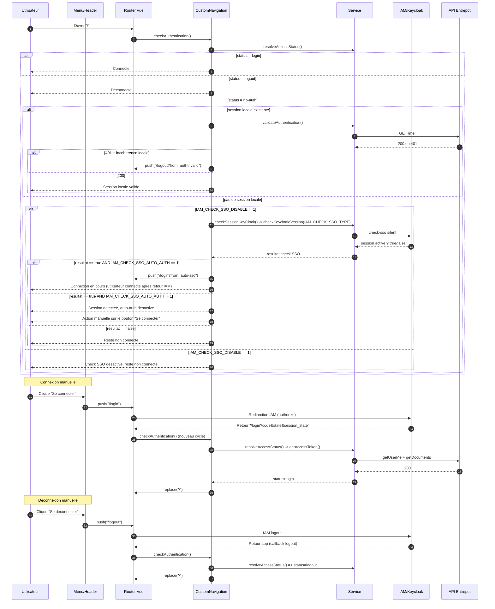
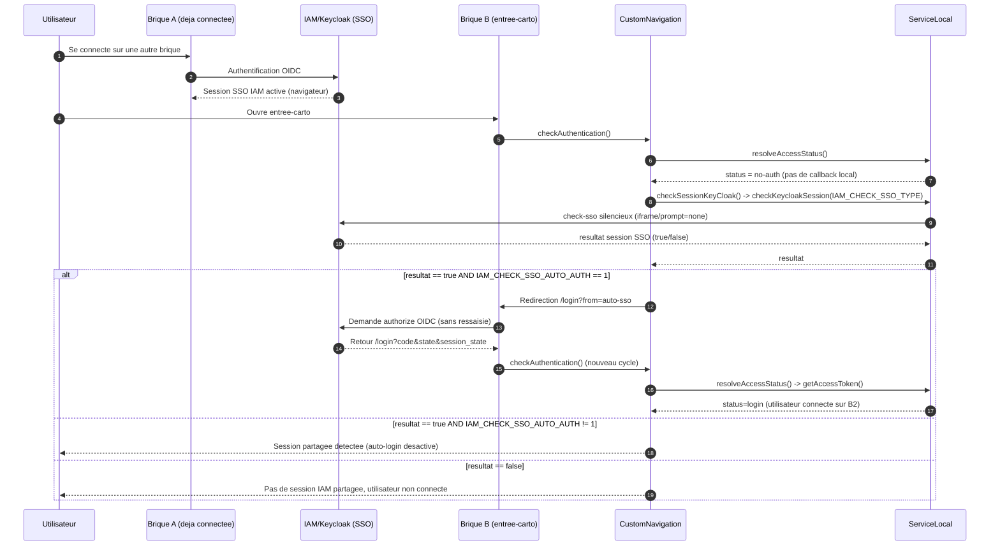

# Authentification & Espace personnel

## Authentification / Session partagée

### Workflow de connexion / déconnexion utilisateur



### Workflow de partage de session



### Configuration

Ex. .env.development-local 
```ini
# verification de session SSO (1=désactivé)
IAM_CHECK_SSO_DISABLE=0
IAM_CHECK_SSO_AUTO_AUTH=1 
IAM_CHECK_SSO_TYPE="keycloak" # 'keycloak' | 'natif' (experimental !)
IAM_CHECK_SSO_TIMEOUT=5000
IAM_CHECK_SSO_CLIENT_ID="cartes-gouv-public"

# désactivation de l'interface de connexion (1=désactivé)
IAM_DISABLE=0
# local|remote
IAM_AUTH_MODE="local"
# Mode auth local
IAM_URL="https://sso.geopf.fr"
IAM_REALM="geoplateforme"
# client_id de l'application carto sur le sso :
# "cartes-gouv-public" ou "cartes-gouv-fr-carto" (GLGe8lcjSj7OytvAeHXABrZRFjbu31ny) 
IAM_CLIENT_ID="cartes-gouv-public"
IAM_CLIENT_SECRET=
```

Pour activer le partage de session : `IAM_CHECK_SSO_DISABLE=0`
Pour activer l'auto login sur une session sso détectée : `IAM_CHECK_SSO_AUTO_AUTH=1`

## Espace personnel

> TODO
